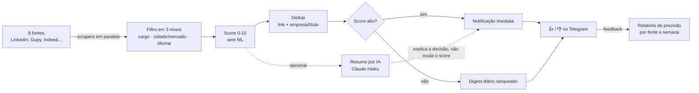

<div align="center">

<!--  -->

# 📡 JobRadar
### Monitor Automatizado de Vagas de Dados & BI


**Autora original:** Liliam Kezia Oliveira Souza
**Fork & reconfiguração de perfil + resumo por IA:** Alexandre W. F. Denófrio

</div>

---

## ✍️ Autoria

O motor de busca é integralmente de **Liliam Kezia Oliveira Souza**: os 8 scrapers, o algoritmo de filtro em 3 níveis de confiança e a fórmula de score por soma de pesos — desenhados e testados originalmente para o perfil dela (Dados/BI júnior-pleno, cidades do Nordeste).

A partir daqui é o fork de **Alexandre Denófrio**: reconfiguração dos dados de busca para o próprio perfil (cargos-alvo de Master Data/Governança de Dados/SAP, cidade São Paulo, mercado internacional EUA/Reino Unido reincluído, pesos de senioridade invertidos) sem alterar a lógica de filtro/score original, e a adição de uma camada nova — **resumo de vaga por IA** (`core/ia_resumo.py`), opcional e desligada por padrão, ver seção [Resumo por IA](#-resumo-de-vaga-por-ia-opcional) abaixo.

---

## 💎 Proposta de valor

> Em cidade pequena, vaga boa de Dados/BI aparece pouco e some rápido — quem checa o board duas vezes por dia perde pra quem checou na primeira hora. **JobRadar** é um sistema de monitoramento contínuo que substitui essa checagem manual: varre **8 fontes** a cada **3 horas**, filtra por cargo/cidade/mercado/idioma com três níveis de confiança, pontua cada vaga por relevância e notifica no Telegram — rodando de graça, sem servidor próprio, 24 horas por dia.

## 📄 Resumo executivo

Entre 07 e 15 de agosto, o sistema já processou **1.052 vagas únicas**, sem intervenção manual nenhuma — mas os números também expõem os riscos reais da arquitetura atual:

| Achado | Número |
|---|---|
| 📊 Vagas processadas (deduplicadas) | **1.052** |
| 🔗 Concentração numa única fonte (LinkedIn) | **89,5%** |
| 🧪 Casos de teste parametrizados (477 instâncias no total; 79 falham hoje por débito de reconfiguração — ver seção Testes) | **78** |
| 🌎 Fontes monitoradas em paralelo | **8** |
| ⏱️ Frequência de checagem | **a cada 3h** |
| 💰 Custo de infraestrutura | **R$ 0** |

A concentração em LinkedIn é um risco medido, não ignorado: o endpoint usado não é oficial e o próprio código documenta a chance de bloqueio — por isso parte do trabalho recente foi medir o rendimento de cada fonte secundária e paginar mais fundo nelas, em vez de só empilhar fonte nova.

---

## 📸 Como chega pra você

<!--  -->

Vaga de alta relevância chega na hora, com motivo da aprovação, nível e link. O resto do dia entra num resumo único, ranqueado — sem virar spam.

---

## 🗂️ Sumário

- [Como funciona (pipeline)](#-como-funciona-pipeline)
- [Arquitetura técnica](#%EF%B8%8F-arquitetura-técnica)
- [Resumo de vaga por IA (opcional)](#-resumo-de-vaga-por-ia-opcional)
- [Estrutura do repositório](#-estrutura-do-repositório)
- [Como rodar](#-como-rodar)
- [Testes](#-testes)

---

## 🧭 Como funciona (pipeline)

| Etapa | O que faz |
|---|---|
| **Busca** | Varre as fontes em paralelo, com rodízio de termos pra controlar custo por ciclo |
| **Filtra** | Cargo (forte / ambíguo + qualificador / ferramenta + cargo), cidade ou mercado remoto, idioma |
| **Pontua** | Score 0–10 por vaga: cargo, ferramenta, senioridade, mercado, idioma — soma de sinais, sem IA |
| **Deduplica** | Por link e por empresa+título, pra pegar a mesma vaga republicada em fonte diferente |
| **Notifica** | Alta relevância na hora; o resto num resumo diário ranqueado, melhor vaga no topo |
| **Aprende** | Botão 👍/👎 em cada notificação — feedback vira dado pra medir precisão por fonte e por semana |



## 🏗️ Arquitetura técnica

- **Filtro em 3 níveis de confiança:** cargo inequívoco passa sozinho; cargo ambíguo (ex: "Business Analyst") só conta com qualificador de dados junto no título; ferramenta (ex: "Power BI") só conta com palavra de cargo junto — nada aprova por palavra-chave solta.
- **Score de relevância sem ML:** 5 sinais conhecidos (cargo, ferramenta, senioridade, mercado, idioma), pesos calibrados contra o histórico real do banco, não chutados.
- **Zero infraestrutura:** GitHub Actions como motor de cron, SQLite como banco — versionado no próprio Git, o histórico de vagas já vistas *é* o commit.
- **Resiliente:** nunca marca vaga como "vista" sem confirmar que a notificação saiu; alerta automático se metade das fontes falhar num ciclo; heartbeat diário confirmando que o robô ainda está de pé.
- **78 casos de teste automatizados em CI:** cada caso documenta um bug real já corrigido nesta base — não é cenário hipotético, é regressão registrada (79 das 477 instâncias parametrizadas estão em débito conhecido — ver seção Testes).

## 🤖 Resumo de vaga por IA (opcional)

Camada adicionada por cima do motor original, desligada por padrão. Para as vagas que já bateram o limiar de notificação imediata (score alto, ver `LIMIAR_DIGEST_IMEDIATO`), o Claude (Haiku) gera 1-2 frases explicando por que aquela vaga é relevante — a partir do motivo do filtro por regra e, quando disponível, da descrição da vaga.

Importante: isso **não muda o filtro nem o score**. `Job.relevancia` continua 100% determinístico, calculado antes dessa camada rodar — a IA só explica em linguagem natural uma decisão que o filtro por regra já tomou sozinho.

Sem `ANTHROPIC_API_KEY` configurada no `.env`, `core/ia_resumo.py::gerar_resumo()` devolve `""` na primeira linha, sem importar o SDK nem tentar rede — o projeto roda idêntico ao comportamento original de Liliam pra quem não configurar a chave.

## 📁 Estrutura do repositório

jobradar/
├── README.md
├── requirements.txt
├── main.py ← motor único: um ciclo de busca por perfil
├── perfis.py ← Brasil vs Internacional (dado, não lógica duplicada)
├── config.py / config_intl.py ← cargos, cidades, termos de busca, pesos
├── job.py ← Job, filtro, score de relevância
├── ia_resumo.py ← resumo de vaga por IA (opcional, ver seção acima)
├── relatorio_precisao.py ← aprovadas/notificadas por fonte e por semana
├── database/
│ └── database.py ← SQLite: dedup, fila de digest, metadados
├── notifier/
│ └── telegram.py ← notificação individual, digest, botão 👍/👎
├── scrapers/ ← um módulo por fonte (LinkedIn, Gupy, Indeed...)
├── utils/
│ └── filtro.py
├── tests/ ← 78 casos, roda em CI a cada push
├── data/
│ └── jobs.db ← banco versionado (histórico de dedup)
└── .github/workflows/
├── jobradar.yml ← cron de produção (a cada 3h)
└── testes.yml ← CI

## 💻 Como rodar

```bash
git clone <repo>
cd jobradar
python -m venv venv && venv\Scripts\activate   # Linux/Mac: source venv/bin/activate
pip install -r requirements.txt
python -m playwright install chromium
```

Criar `.env` na raiz com `TELEGRAM_BOT_TOKEN` e `TELEGRAM_CHAT_ID` (via [@BotFather](https://t.me/BotFather)). Opcionalmente, adicionar `ANTHROPIC_API_KEY` (via [console.anthropic.com](https://console.anthropic.com)) pra ligar o resumo de vaga por IA — sem ela, essa camada fica desligada e o resto do projeto roda igual. Depois:

```bash
python main.py --perfil brasil internacional --once
```

## 🧪 Testes

```bash
pytest tests/ -v
```

78 casos parametrizados (477 instâncias, contando cada combinação de parâmetro), cobrindo a camada de filtro, o parsing de callback do Telegram, o relatório de precisão e o resumo por IA — todos rodando automaticamente a cada push via GitHub Actions.

**Débito conhecido, não escondido:** 79 dessas instâncias falham hoje (`test_regras_de_negocio.py`, `test_uf_por_extenso.py` e `test_senior.py`) porque fixam o comportamento do perfil *anterior* de Liliam (cidades do Nordeste aceitas, EUA/Reino Unido rejeitados, Júnior/Pleno priorizado) — exatamente o oposto do que o perfil reconfigurado de Alexandre quer. Não são bugs novos: são regressão esperada de uma reconfiguração de perfil que ainda não teve a suíte reescrita para o novo alvo. `test_filtro.py`/`test_escopo_localizacao.py` já foram corrigidos (ver `docs/adr/0001-cidades-sao-paulo-somente.md`). Decisão consciente de não reescrever os 3 arquivos restantes ainda (ver commit history) — bom primeiro contato para quem quiser contribuir.

---

<div align="center">

*Case de portfólio em automação de dados — Python, Playwright, SQLite, GitHub Actions, engenharia de filtro sem ML e uma camada opcional de resumo por IA (Claude).*

</div>
